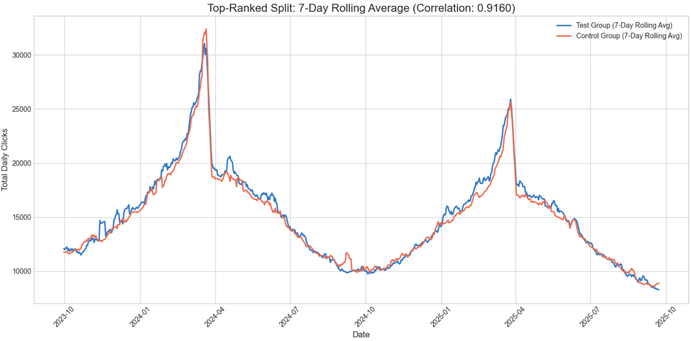

# SEO IRL 2025 
By: Jean-Christophe Chouinard
- [jcchouinard.com](https://www.jcchouinard.com/)
- [youtube.com/@jcchouinard](https://www.youtube.com/@jcchouinard)
- [twitter.com/ChouinardJC](https://x.com/ChouinardJC)
- [linkedin.com/in/jeanchristophechouinard](https://www.linkedin.com/in/jeanchristophechouinard)

This repository contains Python code and scripts designed to help SEO professionals implement the enduring, long-term principles of SEO, as discussed in the presentation "From SERPs to AI Search" shared at SEOIRL.

Originally published here:

[SEO Experiments: Create Test and Control Groups (with Python)](https://www.jcchouinard.com/python-seo-experiments-create-test-and-control-groups/)

## Get Started

```
$ python3 -m venv venv
$ source venv/bin/activate
$ pip install -r requirements.txt
```


## test_splitter.py 
`test_splitter.py` takes in a `sample.csv` file with 3 columns:
- date,
- url,
- clicks

This code is meant to show you the kind of logic that you could use to create comparable control and test group splits. 

1. Loads historical website traffic data from a CSV.
2. Excludes pages with too many data outliers ("Unused").
3. Iteratively shuffles the remaining pages into test/control groups.
4. Finds the most statistically similar group pairing (best correlation).
5. Generates a detailed quality assessment report for the split.
6. Saves the final group assignments to a new CSV.
7. Logs all text output to a .txt file.
8. Creates charts comparing the selected groups' performance over time.


## Output

This will return a visualization of your splits. An assignments.csv file with the details of your URLs and splits and an analysis_log.txt that returns the detail from the code execution. 

### Visualizations



### Assignments

```
                           URL    Group
0    https://example.com/page0     Test
1    https://example.com/page1     Test
2   https://example.com/page10  Control
3   https://example.com/page11  Control
4   https://example.com/page12  Control
...
```

### Analysis_log

```
Step 1: Loading data from 'sample.csv'...
✅ Data loaded and prepared.

Step 2: Filtering data to the last 2 years...
✅ Data filtered. Using records from 2023-09-23 to today.

Step 3: Identifying pages with >20% outliers to exclude...
✅ Found 0 pages to mark as 'Unused'.
✅ Proceeding with 100 usable pages.

Step 4: Performing 10 shuffles to find the best Test/Control split...
  Shuffle 1/10: Similarity (Pearson correlation) = 0.9035
  Shuffle 2/10: Similarity (Pearson correlation) = 0.8901
  Shuffle 3/10: Similarity (Pearson correlation) = 0.9032
  Shuffle 4/10: Similarity (Pearson correlation) = 0.8909
  Shuffle 5/10: Similarity (Pearson correlation) = 0.8936
  Shuffle 6/10: Similarity (Pearson correlation) = 0.9006
  Shuffle 7/10: Similarity (Pearson correlation) = 0.9146
  Shuffle 8/10: Similarity (Pearson correlation) = 0.9010
  Shuffle 9/10: Similarity (Pearson correlation) = 0.8967
  Shuffle 10/10: Similarity (Pearson correlation) = 0.9066
✅ Found best split with a correlation of 0.9146.

Step 5: Generating final outputs for the top-ranked split...
--- OUTPUT 1: Split Quality Assessment ---
📊 Correlation Score: 0.9146
   Assessment: Good. The groups are well-correlated.

📈 Minimum Detectable Effect (MDE):
   With 80% power and 95% confidence, you would need to see a lift of at least 2.54% to declare a statistically significant result.
   (This corresponds to an average daily click change of ~442 clicks.)

✅ Final Verdict: The experimental setup is viable.

...
```

## Disclaimer
This code is quite simplistic and meant for educational purposes, as an alternative to pseudo-code, helping to understand what a splitting logic should look like. Most of the code what written by Gemini and reviewed by me, without that much work put into validating splits and no deep analysis in choosing the best parameters. It is recommended to do hyperparameter tuning and adapt the rules to your own data.


## impact_analysis.py

Causal Impact Python wrapper is broken, but that is allright, we don't need it. We can run Difference-in-Difference and plot results similar to how Causal Impact does.

Once again, this is not code to put in production, but code to understand the logic of how to calculate Diff in Diff. 

1. Loads pre-assigned test and control group data.
2. Performs a Difference-in-Differences (DiD) regression analysis.
3. Calculates the experiment's lift and statistical significance.
4. Saves the text-based results to a log file.
5. Plots a three-panel chart of the causal effect.
6. Allows easy configuration of files, dates, and uplift.

